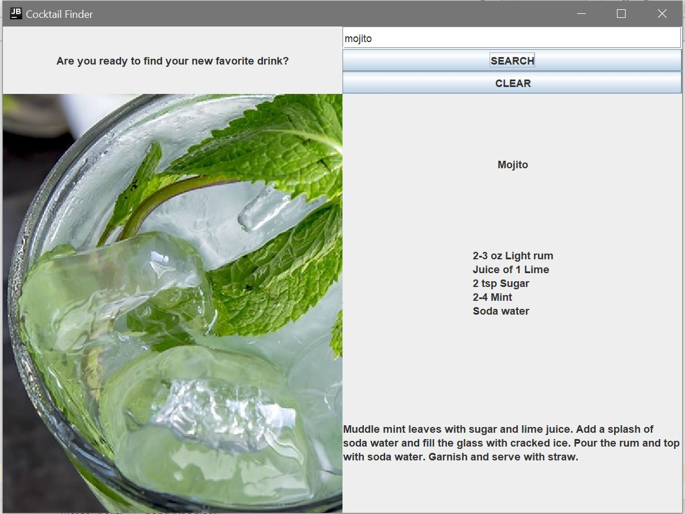

# Cocktail API Display

This is a test application I wrote to demonstrate:

* APIs
* JSON
* Retrofit
* Guice
* Gson
* Mockito
* Swing
* Model-View-Controller pattern
* Factory pattern
* Executable Jar

You can check out the API documentation information [here](https://www.thecocktaildb.com/api.php).

And download an executable jar file [here](build/libs/Cocktails-1.0-SNAPSHOT.jar).

## Functionality
The user can enter the name of a cocktail in the search bar. They'll get back: the title, recipe, instructions, and a picture. 

If there are several drinks that match the search, a random one will be given.

Cheers!

